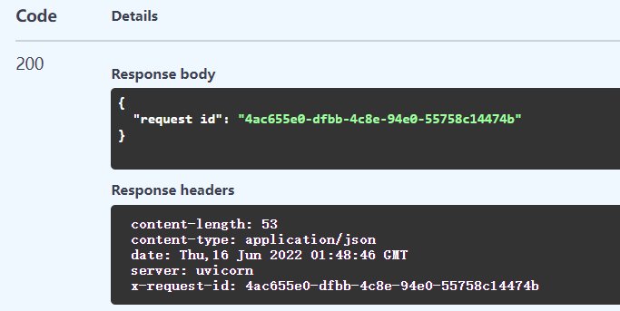

# FastAPI Request ID Middleware

方便日志追踪的request id中间件

使用python uuid作为唯一request id，在response header中携带该id


## 使用说明：
```python
from request_id_middleware import RequestIDMiddleware


app = FastAPI()

app.add_middleware(RequestIDMiddleware)
```
在需要使用该中间件的模块中导入，并添加到FastAPI app实例的middleware中  

```python
# 如果需要在handler中获取request id，请导入get_request_id( )函数
from request_id_middleware import RequestIDMiddleware, get_request_id

...

# get id in test handler
@app.get("/id")
async def get_id():
    return {"request id": get_request_id()}
```
FastAPI Swagger运行效果如下：



## 关于日志功能：
class RequestIDMiddleware中自带日志记录功能
```python
class RequestIDMiddleware(BaseHTTPMiddleware):
    ...

    async def dispatch(self, request: Request, call_next: RequestResponseEndpoint):
        ...

        message = "log for request, request id is: " + get_request_id() + " status code:" + str(response.status_code)
        self.logger.info(message)  # 输出日志

        return response
```
使用logger为"requestIDLogger"

在logging.conf文件中可修改logging相关配置

conf文件格式与写法请参考：https://docs.python.org/zh-cn/3/library/logging.config.html

log输出文件默认为同目录下的logging.log